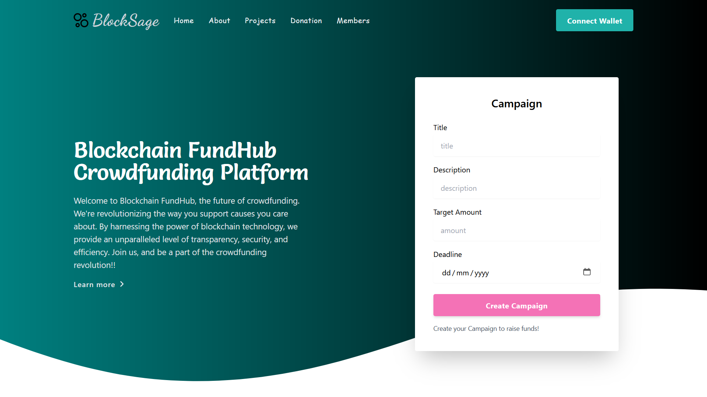

# CrowdFunding Dapp



## Description

Welcome to elegant and innovative CrowdFunding Dapp!

This Dapp provides a seamless and secure platform for individuals and organizations to raise funds for their creative projects, charitable causes, and entrepreneurial ventures. With its user-friendly interface and smart contract technology, you can easily create and manage your crowdfunding campaigns, attracting a global community of supporters.

## Table of Contents

- [Installation](#installation)
- [Usage](#usage)
- [Contributing](#contributing)
- [Contact](#contact)

## Installation

To set up and install the CrowdFunding Dapp, follow these steps:

1. Clone the repository to your local machine:

    ```bash
    git clone https://github.com/Aryan9592/Crowdfunding_Dapp.git
    ```

2. Navigate to the project directory:

    ```bash
    cd Crowdfunding_Dapp
    ```

3. Install the required dependencies:

    ```bash
    npm install
    ```

4. Compile the Smart Contract:

    ```bash
    npx hardhat compile
    ```

5. Run local hardhat blockchain node:

    ```bash
    npx hardhat node
    ```

6. Open a different terminal for deploying the contract to local hardhat blockchain:

    ```bash
    npx hardhat --network localhost run scripts/deploy.js
    ```

7. Run the Deployment Server:

    ```bash
    npm run dev
    ```

8. Access the CrowdFunding Dapp in your web browser at `http://localhost:3000`.

## Usage

The CrowdFunding Dapp is designed to provide a seamless experience for creating and managing crowdfunding campaigns. Here are the main features and functionalities:

1. **Create a Campaign**: Users can easily create a new crowdfunding campaign by providing details such as the campaign name, description, funding goal, and deadline.

2. **Contribute to a Campaign**: Supporters can contribute funds to a campaign by specifying the amount they wish to donate. The smart contract ensures the security and transparency of the transactions.

3. **Track Campaign Progress**: The Dapp provides real-time updates on the progress of each campaign, including the amount raised and the remaining time.

<!-- 4. Withdraw Funds: Once a campaign reaches its funding goal, the creator can withdraw the funds and use them for the intended purpose. The smart contract ensures that only the campaign creator can initiate the withdrawal. -->

<!-- 5. Engage with Supporters: The Dapp allows campaign creators to communicate with their supporters through comments and updates, fostering a sense of community and engagement. -->

<!-- With these features, the CrowdFunding Dapp empowers individuals and organizations to bring their creative projects to life and make a positive impact on the world. -->

## Contributing

Contributions to the CrowdFunding Dapp project are welcome! If you have ideas for new features, bug fixes, or improvements, feel free to open a pull request. Please ensure that your contributions align with the project's goals and follow the established coding conventions.

To contribute to the project, follow these steps:

1. Fork the repository to your GitHub account.
2. Create a new branch for your contribution.
3. Make your changes and commit them to your branch.
4. Push your branch to your forked repository.
5. Open a pull request, describing the changes you made and why they should be merged.

Thank you for your interest in improving the CrowdFunding Dapp!

## Contact

React out to me through my [profile](https://github.com/Aryan9592) for any queries!
